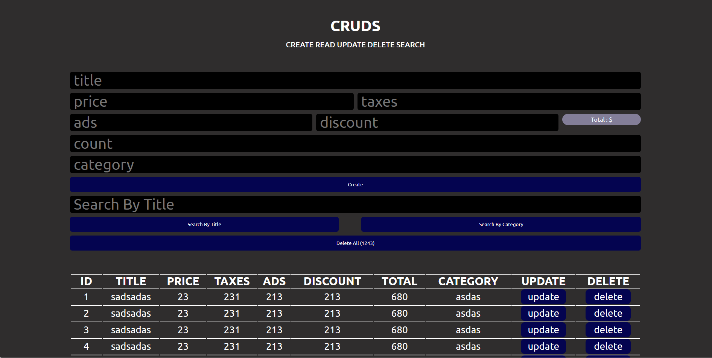

# CRUDS System

This repository contains the code for a CRUDS (CREATE READ UPDATE DELETE SEARCH) system implemented in HTML, CSS, and JavaScript.


## Description

The CRUDS system provides a web-based interface for managing data items with the following features:

- Create new data items with titles, prices, taxes, ads, discounts, total values, and categories.
- Read and display existing data items in a table format.
- Update existing data items.
- Delete individual data items or all data items.
- Search for data items by title or category.

The web page includes a form for data input, a table for displaying data, and buttons for performing CRUDS operations. It also calculates the total value based on input values.


## Usage

To use the CRUDS system:

1. Clone the repository to your local machine using Git:

   ```bash
   git clone https://github.com/mustafawardeh/crud-system.git
2. Open the index.html file in your web browser.

3. Use the form to create, read, update, delete, and search for data items.


## PREVIEW 




## Contributing
If you'd like to contribute to this project, feel free to open an issue or submit a pull request. Contributions are welcome!

